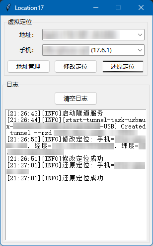

# Location17

适用于iOS 17.x的虚拟定位程序。由于iOS 17.x之后修改定位方式发生变化，以前的虚拟定位程序均已失效，于是仿照location-cleaned写了一个新的虚拟定位程序。



特点：
* 支持iOS 17.x（测试可用的iOS版本：17.5.1~17.6.1）
* 离线使用，无需联网
* 地址管理功能，提前保存地址信息，需要时直接定位到保存的地址
* **没有**地图选点功能，请自行通过其他地图服务获取坐标数据

我不是location-cleaned的作者，请不要询问我有关location-cleaned的问题。

## 使用方法

1、下载/克隆本仓库到本地电脑。

2、确保电脑中已安装Python3和第三方库：
* [pymobiledevice3](https://github.com/doronz88/pymobiledevice3)
* [async-tkinter-loop](https://github.com/insolor/async-tkinter-loop)

```
pip install pymobiledevice3 async-tkinter-loop
```

3、数据线连接苹果手机，并且手机已启用开发者模式。

4、进入仓库目录，**管理员权限**执行：

```
python 程序.py
```

会弹出程序窗口，开始使用吧。

## 常见问题

**点【还原定位】后手机定位没有还原**

还原定位有延迟，稍等一会就行。如果急着还原定位可以重启手机。